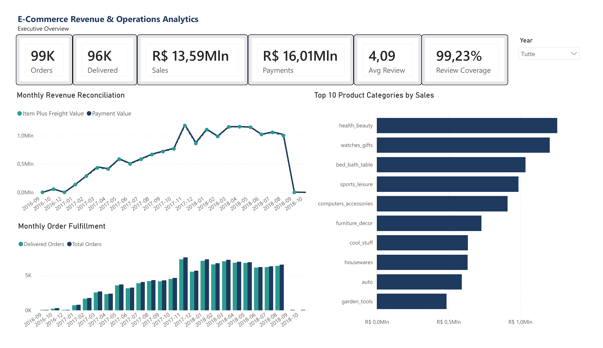

# E-Commerce Revenue & Operations Analytics

**Snowflake · dbt · Power BI · Data Quality · Financial Reconciliation**

End-to-end e-commerce analytics project that transforms raw transactional data into a validated analytical layer and a business-facing Power BI report.

The solution covers ingestion and preparation, dimensional modeling, automated data-quality testing, financial reconciliation, delivery-performance analysis, customer-experience analysis, executive reporting, and a production-style incremental dbt workflow with ingestion metadata and idempotent reruns.

## Power BI Executive Overview



[View the complete Power BI report (PDF)](reports/Ecommerce_Analytics_PowerBI.pdf) · [Read the full case study (PDF)](reports/Ecommerce_Analytics_Case_Study_Federica_Iengo.pdf)

## Project Highlights

- **28 dbt models** across staging, intermediate, dimensional/fact, and business-mart layers
- **249/249 passing dbt regression tests** after the incremental-pipeline upgrade
- **99,441 orders** modeled in the analytical core
- **112,650 order items**
- **98,665 financially comparable orders**
- **303 payment/order-value mismatches** (~0.31%)
- **1,382 temporal delivery anomalies**
- **99.23% review coverage**
- **202 orders with multiple distinct review scores**
- **Incremental dbt order-lifecycle model** using `MERGE`, `unique_key='order_id'`, and `_loaded_at` watermarking
- **Snowflake ingestion metadata** for load timestamp, source filename, and source row number
- **Idempotent reruns verified** with stable row counts and no duplicate `order_id` values
- **4-page Power BI report** covering executive, financial, operational, and customer-experience analysis

## Architecture

```text
Raw E-Commerce Data
        |
        v
Python / pandas
        |
        v
Snowflake RAW + ingestion metadata
        |
        v
dbt Staging
        |
        v
dbt Intermediate
(incremental order lifecycle)
        |
        v
Dimensional / Fact Layer
        |
        v
Business Marts
        |
        v
Power BI
```

### dbt Model Structure

- **9 staging models**
- **10 intermediate models**
- **6 dimensional / fact models**
- **3 business marts**

Core analytical models include:

- `dim_customers`
- `dim_products`
- `dim_sellers`
- `dim_date`
- `fct_orders`
- `fct_order_items`

Business marts:

- `mart_revenue_financial_reconciliation`
- `mart_delivery_operations`
- `mart_customer_experience_reviews`

## Incremental Loading & Data Provenance

The order pipeline includes technical ingestion metadata in the Snowflake RAW and dbt staging/intermediate layers:

- `_loaded_at`
- `_source_filename`
- `_source_row_number`

The historical load timestamp for the existing order dataset was recovered from Snowflake `COPY_HISTORY` and backfilled without replacing it with a later scan timestamp.

`int_orders_lifecycle` is materialized as a true incremental dbt model with:

- `unique_key='order_id'`
- `incremental_strategy='merge'`
- `on_schema_change='sync_all_columns'`
- `_loaded_at` as the ingestion watermark

The incremental filter intentionally reprocesses the latest ingestion batch (`>= max(_loaded_at)`), while `MERGE` on `order_id` keeps reruns idempotent. A normal rerun was validated with **99,441 total rows, 99,441 distinct order IDs, 0 duplicates, and 0 null `_loaded_at` values**.

Technical ingestion fields remain in the incremental layer rather than automatically propagating into the business fact table. `fct_orders` uses an explicit business-column projection so its schema remains stable if upstream technical metadata changes.

## Business Questions

The project was designed to answer questions such as:

- How closely do order-item values reconcile with recorded payment values?
- How many orders contain measurable financial mismatches?
- What delivery-performance patterns and temporal anomalies exist?
- What proportion of orders were delivered on time?
- How complete is customer review coverage?
- How does review sentiment evolve over time?
- Which product categories generate the highest sales value?
- Which data-quality issues should remain visible instead of being silently corrected?

## Financial Reconciliation

The reconciliation layer compares payment value with item plus freight value and exposes discrepancies rather than masking them.

Key findings:

- **98,665** comparable orders
- **98,362** matching orders
- **303** mismatching orders
- **~0.31%** mismatch rate
- Average mismatch: **R$ 10.79**
- Maximum mismatch: **R$ 182.81**

## Operations & Delivery

The operational mart focuses on fulfillment, delivery timing, lead times, and temporal data-quality issues.

Key findings:

- **99K** total orders
- **96K** delivered orders
- **91.89%** on-time delivery rate
- **8.11%** late-delivery rate
- **12.56 days** average delivery time
- **1,382** temporal anomalies

The anomaly logic preserves implausible event sequences for investigation instead of silently rewriting source history.

## Customer Experience

The customer-experience mart combines review completeness, review score distribution, and review-data anomalies.

Key findings:

- **98,673** reviewed orders
- **768** unreviewed orders
- **99.23%** review coverage
- **4.09 / 5** average review score
- **14,449** low-score orders (`<= 2`)
- **76,028** high-score orders (`>= 4`)
- **202** orders with multiple distinct review scores

## Power BI Report

The final report contains four pages:

1. **Executive Overview**  
   Revenue, payments, fulfillment, review KPIs, and top product categories.

2. **Financial Reconciliation**  
   Mismatch rate, mismatching orders, absolute mismatch value, and payment-vs-order-value trends.

3. **Operations & Delivery**  
   On-time vs late delivery, average delivery time, temporal anomalies, and anomaly breakdown.

4. **Customer Experience**  
   Review coverage, review sentiment, average review score, and multiple-review anomalies.

All report pages include a year-level filter for focused analysis.

## Data Quality & Validation

The project uses dbt tests and reconciliation checks to validate both structural integrity and business logic.

Current full regression baseline after the incremental-pipeline upgrade:

```text
PASS=249
WARN=0
ERROR=0
SKIP=0
NO-OP=0
REUSED=0
TOTAL=249
```

Validation includes:

- uniqueness checks
- not-null checks
- relationship integrity
- dimensional/fact grain validation
- orphan checks
- reconciliation logic
- temporal anomaly detection
- review-integrity checks
- incremental-model integrity
- rerun/idempotency validation
- ingestion-metadata completeness

## Technology Stack

- **SQL**
- **Snowflake**
- **dbt Core / dbt-snowflake**
- **Power BI**
- **DAX**
- **Python**
- **pandas**
- **Git / GitHub**

## Repository Structure

```text
ecommerce-revenue-operations-analytics/
├── assets/
│   └── Ecommerce_Analytics_PowerBI_Executive_Overview.png
├── data/
├── dbt/
├── python/
├── reports/
│   ├── Ecommerce_Analytics_Case_Study_Federica_Iengo.pdf
│   └── Ecommerce_Analytics_PowerBI.pdf
├── sql/
└── README.md
```

## Skills Demonstrated

- Analytics engineering
- Incremental ELT modeling
- dbt incremental models and `MERGE` upserts
- Watermark-based incremental loading
- Idempotent pipeline reruns
- Snowflake ingestion metadata and data provenance
- Dimensional modeling
- Data warehousing
- SQL transformation
- dbt project architecture
- Automated data-quality testing
- Financial reconciliation
- Data anomaly investigation
- KPI design
- Business intelligence
- Power BI semantic modeling
- DAX measures
- Stakeholder-oriented reporting

## Portfolio Assets

- [View the complete Power BI report (PDF)](reports/Ecommerce_Analytics_PowerBI.pdf)
- [Read the full project case study (PDF)](reports/Ecommerce_Analytics_Case_Study_Federica_Iengo.pdf)
- [Open the Executive Overview preview](assets/Ecommerce_Analytics_PowerBI_Executive_Overview.png)

The repository also contains the dbt transformation project, automated tests, SQL assets, Python/pandas data-quality workflows, and supporting analytical documentation.

---

**Federica Iengo**  
Data Analytics · Analytics Engineering · Business Intelligence · Data Quality
